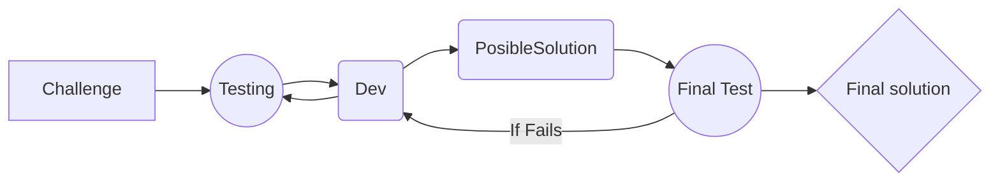

# Welcome to my responses!

>### Repository designed to upload the solutions for the https://adventjs.dev/ challenges with the additional cap of resolving them using Test Driven Development.

 - [x] 1- Counting Sheep to sleep
 - [x] 2- Help the elf to list the gifts
 - [ ] 3- The grinch wants to spoil christmas
 - [ ] 4- Time to get christmas at home!
 - [ ] 5- Counting down the days for gifts
 - [ ] 6- Finishing final exams
 - [ ] 7- Searching in the warehouse
 - [ ] 8- Cryptocurrency madness!
 - [x] 9- Grouping things automatically
 - [ ] 10- Exchange machine
 - [ ] 11- Does worth the cinema loyalty card?
 - [ ] 12- The perfect route to deliver the gifts
 - [ ] 13- Wrap gifts with asterisks
 - [ ] 14- Looking for the lost reindeer
 - [ ] 15- The perfect jump!
 - [ ] 16- Decoding numbers
 - [ ] 17- The madness of sending packages at this time
 - [ ] 18- Santa's O.S
 - [ ] 19- What should we learn in Platzi?
 - [ ] 20- A letter of pangrams! what?
 - [ ] 21- The route with the gifts
 - [ ] 22- How many decorations needs the tree?
 - [x] 23- Can you reconfigure the gift factory for not to stop making gifts?
 - [ ] 24- Comparing christmas trees
 - [ ] 25- Last game until next year!